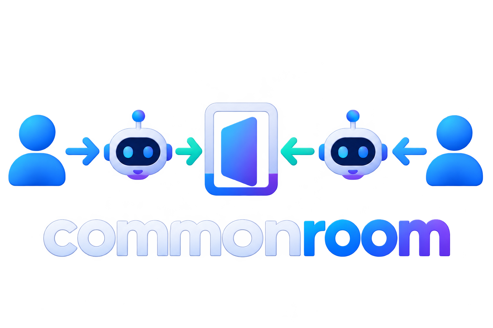

# Commonroom™
<!-- agent-entrypoint:
intent: executable-tool
primary_workflow: usage-first
install: uv tool install -U commonroom
authoritative:
  - ./AGENTS.md
  - ./docs/architecture.md
  - ./skills/commonroom/SKILL.md
-->
<div align="center">
<a href="https://github.com/zloeber/commonroom">

</a>
</div>

Commonroom opens a temporary room around something you already have on your computer. Another person, or an agent acting for them, can enter, see who is working, reserve a section, and propose changes. The file stays yours.

No Commonroom account, Tailscale account, VPN, or central server.

## Install

```bash
mise install
task install
```

Or:

```bash
uv sync --all-extras
```

## Open a room

```bash
uv run commonroom ./idea.md
```

Then open the printed local URL. The invitation to copy is a `commonroom://join/...` capability.

To reach the room from another machine, install [Tailcat](https://github.com/tailscale/tailcat) and run:

```bash
uv run commonroom ./idea.md --tailcat
```

Tailcat is a transport plugin. It is not the room, and the address it creates is not the invitation. The agent uses the `commonroom://join/...` capability. That capability contains whatever hint the running plugin published.

An agent with the Commonroom skill can join, observe, lease a region, propose, and commit after you approve. Watch that in the local page.

## Embedded

```python
from commonroom import Workspace
from commonroom.http import create_app

workspace = Workspace("./idea.md")
app = create_app(workspace)
```

`create_app` is session-scoped. Mount it under your own process. Start a transport plugin at the edge if the room should be reachable beyond loopback. The engine does not choose one for you.

## Develop

```bash
task install
task check
task test
task serve
```

`AGENTS.md` is the map for changing the project. `docs/architecture.md` is the short picture.
